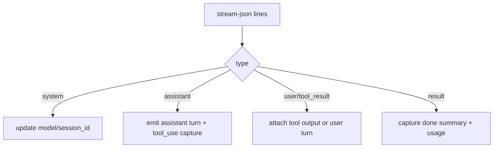

# Claude Code Adapter

> The Claude adapter shells out to `claude -p` stream-json mode and maps CLI events into unified turn/done outputs.

## Overview

`createClaudeCodeAdapter()` implements `AdapterImpl` with a serialized `handle()` lock, local session id retention, and incremental NDJSON parsing. It persists initialization artifacts (`CLAUDE.md` and skill files) before message handling.

Command execution is delegated to a streaming spawn helper with timeout and forced kill fallback. Stream parser emits incremental `meta`, `turn`, and `result` events.

## Spawn Command

For each handle call, arguments are built as:

- `-p <prompt>`
- optional `--resume <sessionId>`
- `--output-format stream-json --verbose`
- `--dangerously-skip-permissions`
- `--max-turns <N>` (default 90)
- optional `--model <model>`

## Streaming Parse Behavior

Parser details:

- assistant `tool_use` blocks become `ToolCall` entries.
- user `tool_result` blocks attach output back to pending tool calls by `tool_use_id`.
- session id is sourced from system line first, then fallback from result line.
- done token usage maps from `usage.input_tokens` and `usage.output_tokens`.

## Session Continuity

- adapter stores `sessionId` internally.
- incoming `resumeNativeId` overrides current session id before spawn.
- `getNativeId()` returns current session id for host suspend/resume persistence.

## Init Artifacts

On `init(config)`:

- writes `CLAUDE.md` in home dir with instructions.
- writes `.cursor/skills/<name>/SKILL.md` for each skill.
- when message uses non-home project cwd, artifacts are also written into that cwd.

## Error Mapping

- login errors (`not logged in`) are normalized with a guidance message.
- API key/auth patterns are normalized to explicit API key guidance.
- missing resumed session errors mention session id context.
- stderr is truncated to tail length for large outputs.

## Code Pointers

| Package | File | What it does |
|---------|------|--------------|
| `@sumeru/adapter-claude-code` | `packages/adapter-claude-code/src/adapter.ts` | Adapter implementation, spawn arg assembly, init artifact writes, and error handling. |
| `@sumeru/adapter-claude-code` | `packages/adapter-claude-code/src/stream-parser.ts` | Parses stream-json lines into turns, tool calls, session metadata, and done summary. |
| `@sumeru/adapter-claude-code` | `packages/adapter-claude-code/src/spawn.ts` | Streaming process wrapper with timeout and exit metadata capture. |

## See Also

- [Adapter Unified I/O Contract](./adapter-contract.md) — host-facing contract this adapter satisfies.
