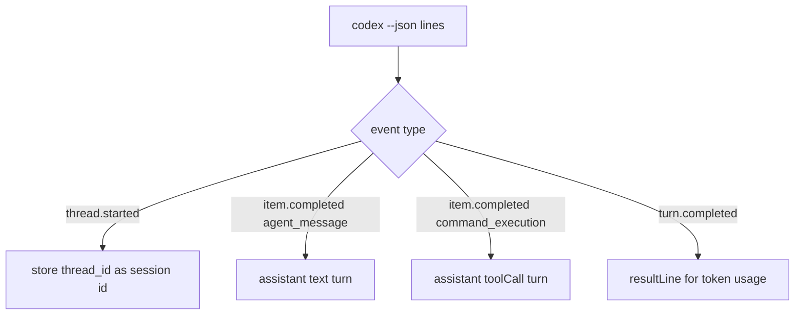

# Codex Adapter

> The Codex adapter runs `codex exec --json`, parses JSONL events, and emits unified turn/done frames with session continuity.

## Overview

`createCodexAdapter()` is structurally similar to the Claude adapter: serialized `handle()`, persistent session id, spawn-per-message runtime, incremental parser, and init artifact writes.

It writes `AGENTS.md` and `.codex/skills/<name>/SKILL.md` from adapter init config, then executes Codex CLI with optional resume and model flags.

## Spawn Command

Base form:

- `codex exec <prompt> --json`
- optional `exec resume <sessionId>` prefix path when resuming
- optional `-m <model>`
- optional `-C <cwd>` on non-resume calls
- defaults enabled:
  - `--dangerously-bypass-approvals-and-sandbox`
  - `--skip-git-repo-check`

## JSONL Parse Mapping

Parser specifics:

- `thread.started.thread_id` is used as native session id.
- `item.completed` with `agent_message` yields assistant content turns.
- `item.completed` with `command_execution` yields tool call turn (`tool: command_execution`) with command, output, and exit code.
- `turn.completed` carries usage counters consumed by `doneValueFromResultLine()`.

## Session Continuity

- `resumeNativeId` from host overrides current adapter session state.
- `getNativeId()` returns current `thread_id`.
- resume failures with “not found/no such session” are mapped to explicit errors.

## Init Artifacts

On init and non-home project sends:

- writes `AGENTS.md` with instructions.
- writes `.codex/skills/*/SKILL.md` for each injected skill.

## Error Mapping

- stderr patterns matching API key/auth errors map to OPENAI API key guidance.
- non-zero exits surface exit code and stderr tail.
- timeout exits surface duration-based timeout error.

## Code Pointers

| Package | File | What it does |
|---------|------|--------------|
| `@sumeru/adapter-codex` | `packages/adapter-codex/src/adapter.ts` | Spawn arg assembly, init artifacts, session state, and error handling. |
| `@sumeru/adapter-codex` | `packages/adapter-codex/src/stream-parser.ts` | JSONL event mapping into turns, tool calls, and done token usage. |
| `@sumeru/adapter-codex` | `packages/adapter-codex/src/spawn.ts` | Streaming child process helper with timeout and force-kill fallback. |

## See Also

- [Adapter Unified I/O Contract](./adapter-contract.md) — standardized host/adapter protocol.
- [Suspend & Resume](./suspend-resume.md) — resume-native-id handoff from Host to Codex sessions.
- [Transport Layer](./transport-layer.md) — process execution environment for Codex adapter.
