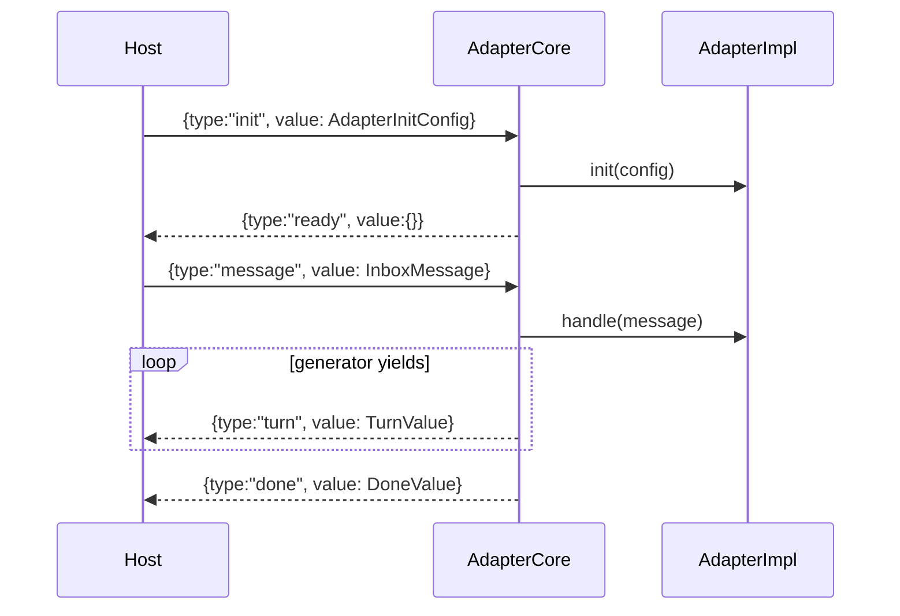

# Adapter Unified I/O Contract

> `@sumeru/adapter-core` defines a strict NDJSON stdin/stdout protocol and runtime wrapper so all adapters expose the same host-facing behavior.

## Overview

Adapter authors implement `AdapterImpl` with `init()`, streaming `handle()`, and optional `getNativeId()`. The core entrypoint (`runAdapterEntry`) parses inbound frames, validates protocol order, streams turns, handles terminal frames, and emits structured errors.

This contract is the key interoperability layer between host and concrete adapter CLIs (Sarsapa, Hermes ACP, Claude Code, Codex).

## Frame Protocol

## Inbound Frames

- `init`: carries instructions, skills, and model config.
- `message`: carries core inbox fields plus `resumeNativeId` for resume continuation.

Protocol checks include:

- duplicate `init` => `protocol_error`
- `message` before init => `init_required`
- invalid JSON or missing `type` => `protocol_error`
- unknown frame type => `protocol_error`

## Outbound Frames

- `ready`: emitted once after successful init.
- `turn`: emitted for each assistant/tool turn from adapter generator.
- `done`: emitted when generator completes with `DoneValue`.
- `suspend`: emitted for timeout or impl-driven suspend yields; includes `nativeId`.
- `error`: emitted for init failures, handler failures, or fatal wrapper failures.

## Suspend Semantics

- Timeout uses `sendTimeoutMs` (default 7,200,000 ms).
- On timeout, core emits `suspend{reason:"timeout"}` and aborts the generator.
- If impl yields `{ type:"suspend" }`, core emits suspend and exits loop.
- `nativeId` comes from `impl.getNativeId()` when available.

## Entrypoint Wrapper

`createAdapterEntry(impl)` wires real `process.stdin/stdout` and SIGTERM handling into `runAdapterEntry()`, preserving the same behavior as test-injected seams.

## Code Pointers

| Package | File | What it does |
|---------|------|--------------|
| `@sumeru/adapter-core` | `packages/adapter-core/src/types.ts` | Declares adapter author interface and frame unions. |
| `@sumeru/adapter-core` | `packages/adapter-core/src/entrypoint.ts` | Implements NDJSON loop, protocol validation, timeout suspend, and errors. |
| `@sumeru/core` | `packages/core/src/types.ts` | Supplies shared payload types used by adapter-core frame values. |

## See Also

- [Claude Code Adapter](./adapter-claude-code.md) — concrete implementation over this contract.
- [Hermes Adapter (ACP)](./adapter-hermes.md) — ACP-backed implementation.
- [Codex Adapter](./adapter-codex.md) — `codex exec --json` implementation.
- [Transport Layer](./transport-layer.md) — process I/O channel carrying frames.
