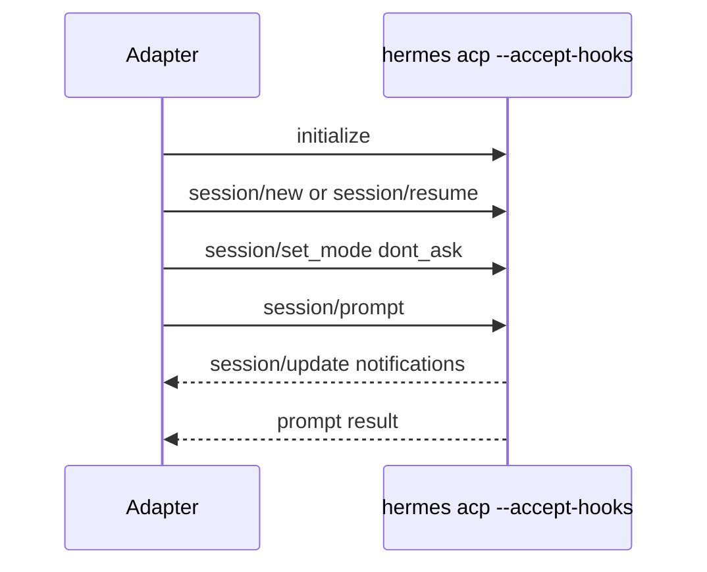

# Hermes Adapter (ACP)

> The Hermes adapter maintains a long-lived ACP JSON-RPC process and translates `session/update` notifications into turn streams.

## Overview

`createHermesAdapter()` uses an ACP client abstraction (`initialize`, `newSession`, `resumeSession`, `prompt`, `setMode`) over stdin/stdout JSON-RPC. Unlike spawn-per-message adapters, Hermes keeps one process alive and sends multiple prompts into ACP sessions.

The adapter writes init artifacts into Hermes home (`SOUL.md` and `skills/*/SKILL.md`) and enforces a serialized `handle()` lock to avoid interleaving prompt streams.

## ACP Interaction Model

## Session + Resume Behavior

- `sessionId` is persistent adapter state and exposed via `getNativeId()`.
- incoming `resumeNativeId` sets target resume session.
- `ensureSession()` either resumes explicit session or creates one when absent.
- after resume/new, adapter always calls `session/set_mode` with `dont_ask`.

## Turn Accumulation

`session/update` notifications are mapped as follows:

- `agent_message_chunk`: appends text to pending assistant content.
- `tool_call`: flushes pending text to turn, then accumulates tool call metadata.
- `usage_update`: stores input/output token counters.

On prompt completion, trailing buffered content and tool calls are flushed into final turns.

## Timeout Suspend

If prompt duration exceeds `sendTimeoutMs` (default 2 hours), adapter yields suspend frame:

- `reason: "timeout"`
- `elapsedMs: sendTimeoutMs`

and returns `DoneValue` with null summary/token usage.

## ACP Client Details

`createAcpClient()` implements:

- request id sequencing and pending map.
- line-buffered stdout parsing.
- response/error routing.
- notification routing for `session/update`.
- process lifecycle rejection on close/error.

## Code Pointers

| Package | File | What it does |
|---------|------|--------------|
| `@sumeru/adapter-hermes` | `packages/adapter-hermes/src/adapter.ts` | Hermes adapter state machine, session orchestration, and turn mapping. |
| `@sumeru/adapter-hermes` | `packages/adapter-hermes/src/acp-client.ts` | ACP JSON-RPC transport client over stdin/stdout. |
| `@sumeru/adapter-hermes` | `packages/adapter-hermes/src/types.ts` | ACP update and client interface types used by adapter/client. |

## See Also

- [Adapter Unified I/O Contract](./adapter-contract.md) — adapter-core contract implemented by Hermes adapter.
