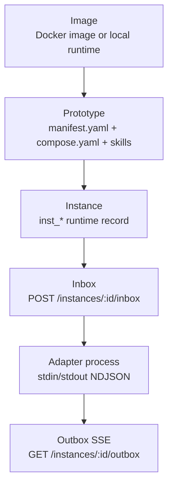
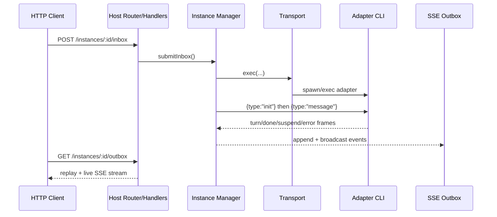

# Architecture Overview

> Sumeru v2 runs a Host-managed multi-agent runtime where instances execute adapter processes through a unified message contract.

## Overview

Sumeru models runtime concerns in three layers: **Image**, **Prototype**, and **Instance**. An image is the runtime environment (container image or local runtime command). A prototype is declarative configuration plus adapter-facing instructions/skills. An instance is the live, addressable runtime object that receives inbox messages and emits outbox events.

`@sumeru/core` is the type backbone: manifests, model config, instance status, inbox payloads, and outbox frame unions (`turn`, `done`, `suspend`, `error`). `@sumeru/host` exposes an HTTP control plane, boots `inst_0` as the reserved master, and routes all traffic into transport + adapter execution.

The host runtime path is: HTTP request enters the route handler, instance manager ensures transport/runtime readiness, host writes NDJSON frames to adapter stdin, adapter streams NDJSON back, host maps frames into SSE events, and optional OCAS JSONL recording persists history.

## Layer Model

## Runtime Responsibilities

- Host HTTP service registers all control/data routes and serializes envelope responses.
- Instance manager owns lifecycle, adapter process sessions, status updates, and suspend/resume state.
- Transport abstraction isolates execution backend: local for master, Docker for workers.
- Adapter core enforces a single unified stdin/stdout contract across providers.
- SSE buffering adds reconnect/replay behavior for outbox consumers.

## Master vs Worker Instances

- `inst_0` is created implicitly at manager boot and has `prototype: null`.
- Master uses routing transport to run locally (`LOCAL_MASTER_HANDLE`) instead of Docker.
- Worker instances are created from prototype names via API and are subject to resource limits.
- Worker adapter command defaults to the Claude adapter entrypoint in container runtime.
- Master adapter command is resolved from `host.yaml` master config or fallback Hermes adapter.

## Message Pipeline

## Code Pointers

| Package | File | What it does |
|---------|------|--------------|
| `@sumeru/core` | `packages/core/src/types.ts` | Defines canonical manifest, model, instance, inbox/outbox, suspend, and token usage types. |
| `@sumeru/host` | `packages/host/src/server.ts` | Builds HTTP host handler, wires routes, transport stack, and manager boot flow. |
| `@sumeru/host` | `packages/host/src/instance-manager.ts` | Owns instance lifecycle, adapter readiness, frame ingestion, and SSE broadcast. |
| `@sumeru/host` | `packages/host/src/local-transport.ts` | Chooses local runtime for master and docker runtime for workers via routing transport. |

## See Also

- [Host HTTP Service](./host-service.md) — route surface and envelope contract.
- [Adapter Unified I/O Contract](./adapter-contract.md) — NDJSON frame protocol.
- [Instance Lifecycle](./instance-lifecycle.md) — creation/reset/deletion/state behavior.
