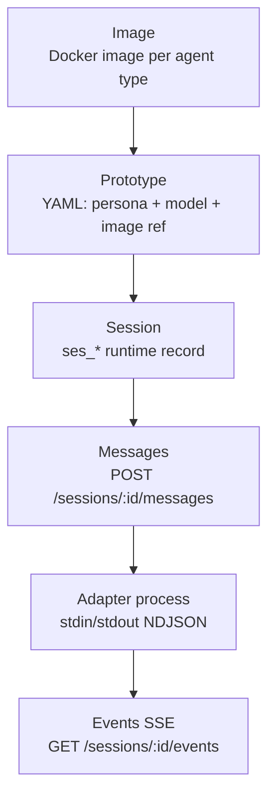
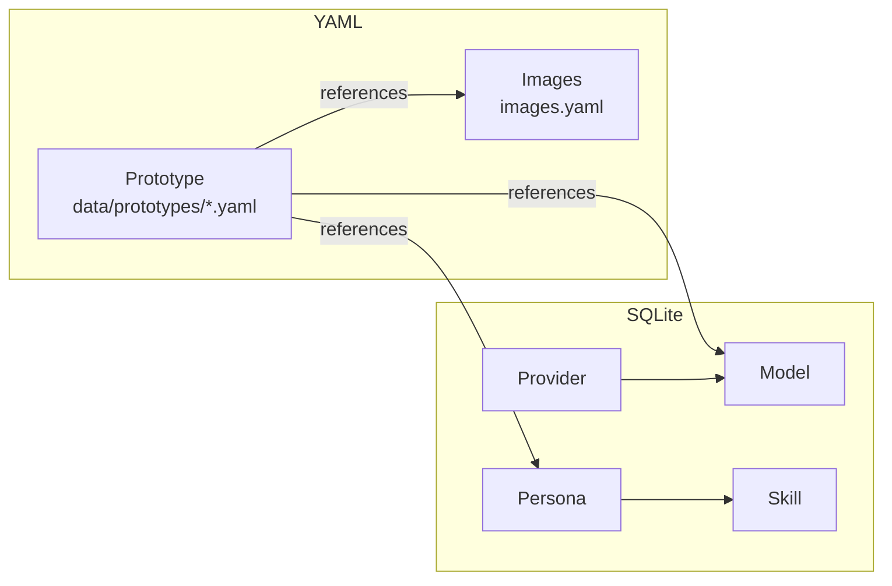
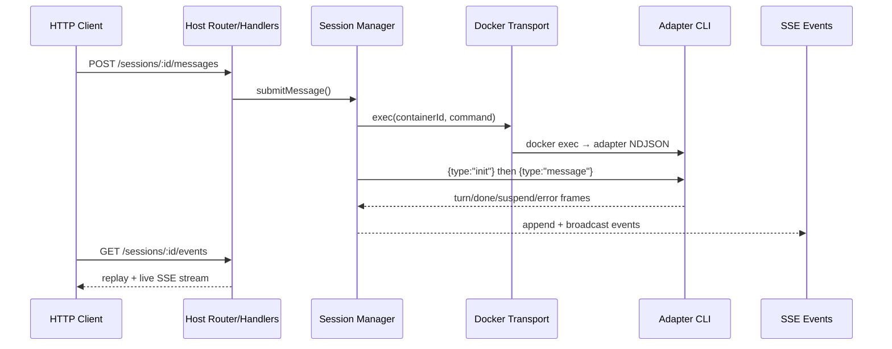

# Architecture Overview

> Sumeru V3 runs a Host-managed multi-agent runtime where sessions execute adapter processes inside Docker containers through a unified NDJSON contract.

## Overview

Sumeru models runtime concerns in three layers: **Image**, **Prototype**, and **Session**. An image is the runtime environment (Docker container). A prototype is declarative configuration binding a persona, model, and image. A session is the live, addressable runtime object that receives messages and emits turn/exit events.

V3 uses a **hybrid data model**: Provider, Model, Persona, and Skill entities live in SQLite (`data/sumeru.db`), while Prototypes remain as YAML files (`data/prototypes/<name>.yaml`) and images are tracked in `images.yaml`. The `@sumeru/host/sqlite` subpath export allows the CLI to share database access with the host.

## Layer Model

## Data Model (SQLite + YAML Hybrid)

- **Provider**: name, apiType (anthropic|openai), baseUrl, apiKey
- **Model**: id, provider FK, model name, contextWindow, toolUse, streaming
- **Persona**: name, instructions, skills[] references
- **Skill**: name, content (text blob)
- **Prototype**: name, persona ref, model ref, image ref, optional defaults
- **Image**: name, description, dockerfile path, builtAt, digest

## Runtime Responsibilities

- Host HTTP service registers all control/data routes and serializes envelope responses.
- Session manager owns lifecycle, adapter process sessions, concurrency slots, and exit signals.
- Transport abstraction isolates Docker Compose execution backend (`up/down/rm/exec`).
- Adapter core enforces a single unified stdin/stdout NDJSON contract across all agent types.
- SSE buffering adds reconnect/replay behavior for event consumers.
- Session model override allows any session to use a different model than its prototype default.

## Message Pipeline

## Code Pointers

| Package | File | What it does |
|---------|------|--------------|
| `@sumeru/core` | `packages/core/src/types.ts` | Defines canonical Provider, Model, Persona, Prototype, Session, Turn, Image types. |
| `@sumeru/host` | `packages/host/src/server.ts` | Builds HTTP handler, wires all routes via segment-based router. |
| `@sumeru/host` | `packages/host/src/config.ts` | Loads host.yaml + images.yaml + prototypes, opens SQLite store. |
| `@sumeru/host` | `packages/host/src/sqlite-store.ts` | SQLite CRUD for Provider, Model, Persona, Skill entities. |
| `@sumeru/host` | `packages/host/src/session-manager.ts` | Owns session lifecycle, adapter readiness, frame ingestion, and SSE broadcast. |

## See Also

- [Host HTTP Service](./host-service.md) — route surface and envelope contract.
- [Adapter Unified I/O Contract](./adapter-contract.md) — NDJSON frame protocol.
- [Session Lifecycle](./instance-lifecycle.md) — creation/stop/deletion/state behavior.
- [Data Model](./manifest-schema.md) — SQLite + YAML schema details.
