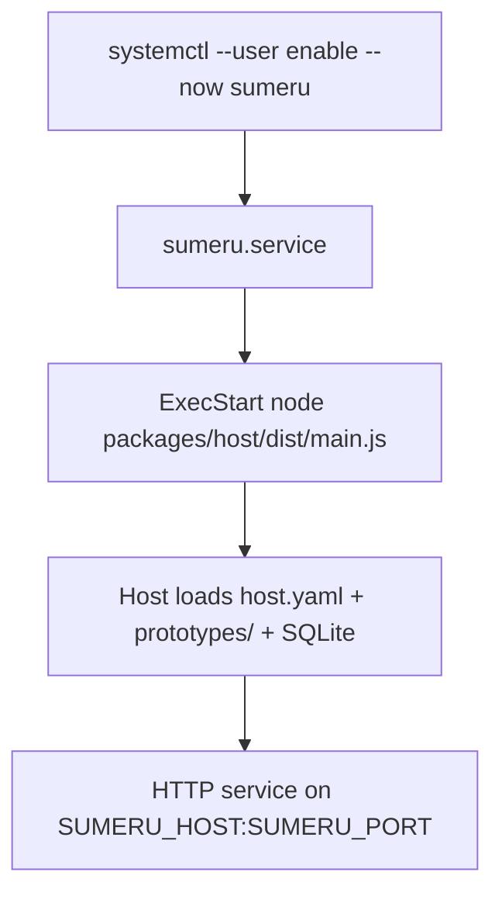

# Deployment

> Sumeru host is deployed as a systemd user service that launches the host entrypoint with a repository root argument.

## Overview

Deployment ships with a user unit file (`deploy/sumeru.service`) and operational README. The unit runs `node packages/host/dist/main.js <rootDir>`, restarts automatically, and loads optional environment overrides from `~/.config/sumeru/env`.

By default it sets port `7900` and expects the repository layout under `%h/repos/sumeru`.

## systemd User Unit

`deploy/sumeru.service` includes:

- `Type=simple`
- `WorkingDirectory=%h/repos/sumeru`
- `Environment=PATH=...` (includes npm global bin and ~/.local/bin for adapter CLIs)
- `EnvironmentFile=-%h/.config/sumeru/env` (optional, for API keys)
- `Restart=always` + `RestartSec=5`

## Host Entry Expectations

`packages/host/src/main.ts` reads runtime root directory from CLI argv and environment host/port values, then starts the host server. The root directory must contain `host.yaml`.

## Configuration Layout

From deployment docs + host loader behavior:

- Root directory must contain `host.yaml`.
- Prototypes defined in `data/prototypes/*.yaml`.
- Compose files at `prototypes/<name>/compose.yaml`.
- SQLite database at `data/sumeru.db`.
- Images tracked in `images.yaml`.
- Data directory defaults to `<root>/data`.

## Operations

Typical lifecycle commands:

- `systemctl --user daemon-reload`
- `systemctl --user enable --now sumeru`
- `systemctl --user status sumeru`
- `journalctl --user -u sumeru -f`
- `systemctl --user restart sumeru`

## Environment and Credentials

- `SUMERU_HOST` defaults to `127.0.0.1` when unset.
- `SUMERU_PORT` defaults to `7900` when unset.
- API keys and adapter credentials go in the env file (`~/.config/sumeru/env`) — not in the unit file or git.
- Service-level PATH must include npm global bin for CLI-based adapters (claude-code, codex).

## Code Pointers

| Package | File | What it does |
|---------|------|--------------|
| `deploy` | `deploy/sumeru.service` | systemd user unit definition for host process. |
| `deploy` | `deploy/README.md` | Installation and operations guide. |
| `@sumeru/host` | `packages/host/src/main.ts` | Host process entrypoint used by service ExecStart. |
| `@sumeru/host` | `packages/host/src/config.ts` | Loads host.yaml, SQLite store, prototypes, and images. |

## See Also

- [Host HTTP Service](./host-service.md) — server started by service unit.
- [CLI Tool](./cli.md) — `server start/stop/status` as alternative to systemd.
