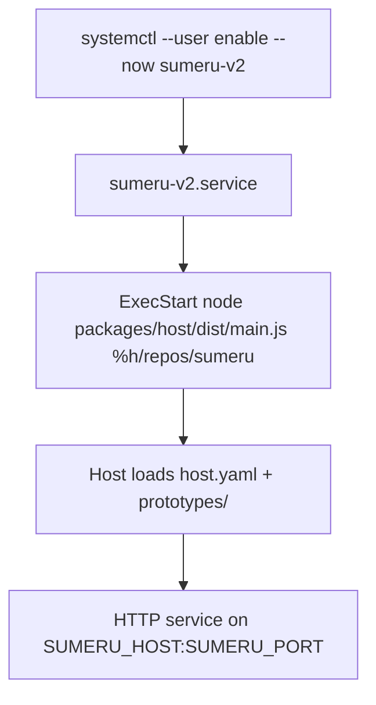

# Deployment

> Sumeru v2 host is deployed as a systemd user service that launches the built host entrypoint with a repository root argument.

## Overview

Deployment guidance ships with a user unit file and operational README. The unit runs `node packages/host/dist/main.js <rootDir>`, restarts automatically, and loads optional environment overrides from `~/.config/sumeru/env`.

By default it sets `SUMERU_PORT=7900` and expects repository layout under `%h/repos/sumeru`.

## systemd User Unit

`deploy/sumeru-v2.service` includes:

- `Type=simple`
- `WorkingDirectory=%h/repos/sumeru`
- `Environment=SUMERU_PORT=7900`
- `EnvironmentFile=-%h/.config/sumeru/env`
- `Restart=always` + `RestartSec=5`

## Host Entry Expectations

`packages/host/src/main.ts` reads runtime root directory from CLI argv and environment host/port values, then starts the host server.

Deployment docs require host build artifacts (`pnpm run build`) before starting systemd unit.

## Configuration/Layout Notes

From deployment docs + host loader behavior:

- Root directory must contain `host.yaml`.
- Prototypes are scanned from `<root>/prototypes/`.
- Each prototype directory should contain `manifest.yaml` and `compose.yaml`.
- Optional data dir defaults to `<root>/data` when `host.yaml dataDir` is unset.

## Operations

Typical lifecycle commands:

- `systemctl --user daemon-reload`
- `systemctl --user enable --now sumeru-v2`
- `systemctl --user status sumeru-v2`
- `journalctl --user -u sumeru-v2 -f`
- `systemctl --user restart sumeru-v2`

## Environment and Port Binding

- `SUMERU_HOST` is read by host main and defaults to `127.0.0.1` when unset.
- `SUMERU_PORT` is read by host main and defaults to `7900` when unset.
- Unit file sets `SUMERU_PORT=7900` explicitly, and optional env file can override credentials or adapter env vars.
- Service-level environment affects adapter subprocesses spawned by host.

## Root Directory Contract

- `ExecStart` passes one positional root directory argument to host main.
- Host config loader expects this root to contain `host.yaml` and `prototypes/`.
- Wrong root argument results in startup failure while loading config files.

## Code Pointers

| Package | File | What it does |
|---------|------|--------------|
| `deploy` | `deploy/sumeru-v2.service` | systemd user unit definition for v2 host process. |
| `deploy` | `deploy/README.md` | Installation and operations guide for service deployment. |
| `@sumeru/host` | `packages/host/src/main.ts` | Host process entrypoint used by service `ExecStart`. |
| `@sumeru/host` | `packages/host/src/config.ts` | Loads `host.yaml`, scans prototypes dir, and resolves runtime config. |

## See Also

- [Host HTTP Service](./host-service.md) — server started by service unit.
- [Master Agent](./master-agent.md) — master runtime behavior under deployed host.
