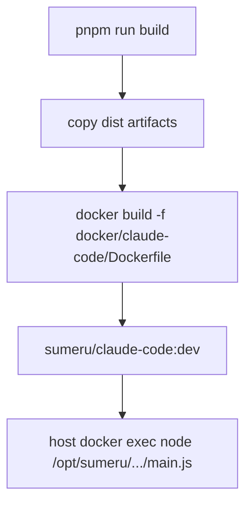

# Docker Image Build

> The Claude runtime image packages Node, Python, Claude CLI, and built adapter artifacts for host-driven `docker exec` invocation.

## Overview

The image is defined in `docker/claude-code/Dockerfile` and built by `scripts/build-image.sh`. Build script compiles the monorepo first (`pnpm run build`), then performs a local Docker build tagged `sumeru/claude-code:dev`.

Runtime behavior is intentionally passive (`sleep infinity`) because host controls execution by entering the container with `docker exec` and running adapter entry commands.

## Build Composition

## Dockerfile Layers

- Base image: `node:22-slim`.
- Apt packages: `git`, `curl`, `ca-certificates`, `build-essential`.
- Python: installs `uv`, then Python `3.12` symlinked to `python`/`python3`.
- Claude CLI: `npm install -g @anthropic-ai/claude-code`.
- Copies built workspace package artifacts into `/opt/sumeru`:
  - `core/dist`
  - `adapter-core/dist`
  - `adapter-claude-code/dist`
- Creates symlinked `node_modules/@sumeru/*` workspace links for runtime resolution.

## Runtime Security/Execution

- Creates non-root user `sumeru` with uid `10001`.
- Changes ownership on `/opt/sumeru` and uv python dir.
- switches to `USER sumeru` and `WORKDIR /home/sumeru`.
- default command: `CMD ["sleep", "infinity"]`.

## Build Script

`build-image.sh`:

- changes to repo root.
- runs monorepo build.
- temporarily copies `docker/.dockerignore` into repo root `.dockerignore`.
- builds image with Dockerfile path.
- removes temporary `.dockerignore`.

## Why `sleep infinity`

- Container lifecycle is decoupled from adapter lifecycle.
- Host keeps container warm and enters it on demand via `docker exec`.
- Adapter process exits at turn boundaries without killing container.
- This reduces cold start cost between instance messages.

## Artifact Contract

- Dockerfile expects prebuilt `dist/` outputs for copied packages.
- Runtime Node resolution depends on symlinked `node_modules/@sumeru/*` links.
- If package names or dist layout changes, both copy paths and symlinks must be updated together.
- Build script’s pre-build step is required to keep image contents in sync with source.

## Code Pointers

| Package | File | What it does |
|---------|------|--------------|
| `docker` | `docker/claude-code/Dockerfile` | Defines runtime image composition and non-root execution model. |
| `scripts` | `scripts/build-image.sh` | Reproducible local build script for `sumeru/claude-code:dev`. |
| `@sumeru/host` | `packages/host/src/transport.ts` | Executes adapter command inside running container via `docker exec`. |

## See Also

- [Transport Layer](./transport-layer.md) — how host interacts with running container.
- [Claude Code Adapter](./adapter-claude-code.md) — adapter binary executed inside container.
