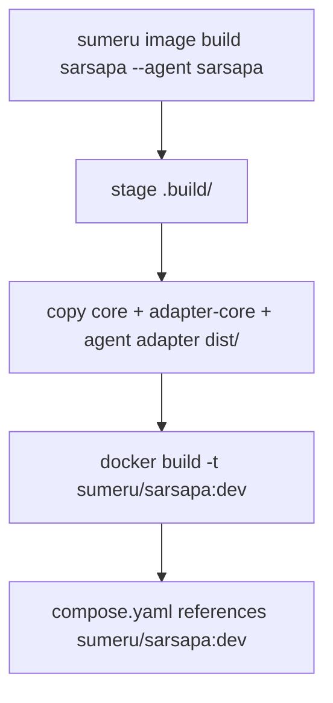

# Docker Image Build

> Each supported agent type has its own Dockerfile under `packages/adapter-<agent>/`. The `sumeru image build` CLI assembles dist artifacts and builds tagged images for host-driven `docker exec` invocation.

## Overview

V3 supports multiple agent runtimes: **sarsapa** (native), **hermes** (ACP), **claude-code**, and **codex**. Each has a dedicated Dockerfile in `packages/adapter-<agent>/Dockerfile`. The build process is handled by `sumeru image build <name> --agent <type>`, which stages monorepo artifacts into a `.build/` directory and runs `docker build`.

Docker image tags are **not** stored in a separate registry entity. Tags follow adapter naming: `sumeru/sarsapa:dev` for sarsapa, `sumeru/adapter-<name>:dev` for other adapters. The tag is referenced directly in `prototypes/<name>/compose.yaml`.

## Build Pipeline



Artifacts staged into `.build/packages/`:
- `core/` — `@sumeru/core` dist + package.json
- `adapter-core/` — `@sumeru/adapter-core` dist + package.json
- `<agent>/` — agent-specific adapter dist + package.json

## Image Variants

| Agent | Dockerfile | Base Image | Key Extras |
|-------|-----------|------------|------------|
| sarsapa | `packages/sarsapa/Dockerfile` | `node:24-slim` | ripgrep, git, build-essential |
| hermes | `packages/adapter-hermes/Dockerfile` | `node:22-slim` | hermes CLI (ACP), git, curl |
| claude-code | `packages/adapter-claude-code/Dockerfile` | `node:22-slim` | Python (uv), Claude CLI, git |
| codex | `packages/adapter-codex/Dockerfile` | `node:22-slim` | Codex CLI, git |

## Runtime Model

All images use `CMD ["sleep", "infinity"]` — the container stays warm and the host enters it on demand via `docker exec` to run the adapter entrypoint.

- Container lifecycle is decoupled from adapter lifecycle.
- Host keeps container alive across messages (no cold start between turns).
- Adapter process exits at turn boundaries without killing container.

## Sarsapa Dockerfile (reference)

- Base: `node:24-slim` with git, curl, ripgrep, build-essential.
- Copies `core`, `adapter-core`, `sarsapa` dists into `/opt/sumeru/`.
- Creates `node_modules/@sumeru/*` symlinks for runtime resolution.
- Runs as `node` user in `/workspace`.
- Entrypoint: `node /opt/sumeru/adapter-sarsapa/dist/main.js`

## Compose Integration

Each prototype's `prototypes/<name>/compose.yaml` declares the Docker image tag:

```yaml
services:
  agent:
    image: sumeru/sarsapa:dev
    volumes:
      - "${SUMERU_PROJECT_PATH}:${SUMERU_PROJECT_PATH}"
```

`sumeru image build` builds the image locally but does **not** register it anywhere — the compose file is the source of truth for which tag to use.

## Code Pointers

| Package | File | What it does |
|---------|------|--------------|
| adapter package | `packages/sarsapa/Dockerfile` | Native sarsapa agent runtime image. |
| adapter package | `packages/adapter-hermes/Dockerfile` | Hermes ACP agent runtime image. |
| adapter package | `packages/adapter-claude-code/Dockerfile` | Claude Code CLI runtime image. |
| adapter package | `packages/adapter-codex/Dockerfile` | Codex CLI runtime image. |
| `@sumeru/cli` | `packages/cli/src/image-build.ts` | Build pipeline: staging and docker build. |

## See Also

- [CLI Tool](./cli.md) — `image build` command.
- [Transport Layer](./transport-layer.md) — how host interacts with running containers.
- [Architecture Overview](./architecture-overview.md) — prototype and adapter image in the runtime model.
