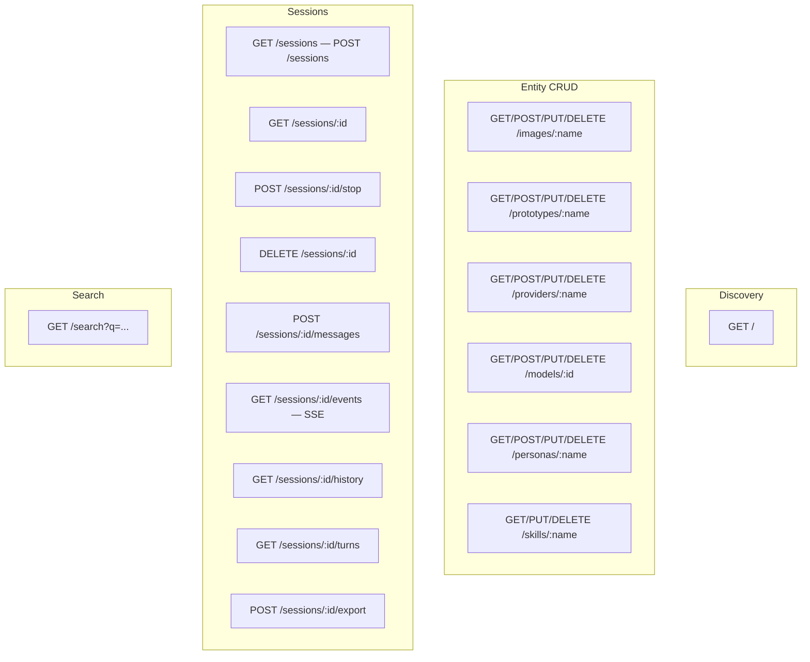

# Host HTTP Service

> The host provides a comprehensive HTTP API for discovery, entity CRUD (providers, models, personas, skills, images, prototypes), session lifecycle, message ingress, and event/history egress.

## Overview

`createHostHandler()` composes a route table over a segment-based router. Routes are method-scoped, support `:param` placeholders, and return typed envelope responses (`{ type, value }`). Error responses use `@sumeru/error` envelopes with machine code and human message.

## Route Surface



## Full Route Table

| Method | Path | Description |
|--------|------|-------------|
| GET | `/` | Host info: name, version, status counts, uptime |
| GET/POST/DELETE | `/images[/:name]` | Image registry CRUD |
| GET/POST/PUT/DELETE | `/prototypes[/:name]` | Prototype CRUD (backed by YAML files) |
| GET/POST/PUT/DELETE | `/providers[/:name]` | Provider CRUD (SQLite) |
| GET/POST/PUT/DELETE | `/models[/:id]` | Model CRUD (SQLite) |
| GET/POST/PUT/DELETE | `/personas[/:name]` | Persona CRUD (SQLite) |
| GET/PUT/DELETE | `/skills/:name` | Skill CRUD (SQLite) |
| GET/POST | `/sessions` | List sessions / Create session |
| GET | `/sessions/:id` | Session detail |
| POST | `/sessions/:id/stop` | Stop running session |
| DELETE | `/sessions/:id` | Delete session (tears down container) |
| POST | `/sessions/:id/messages` | Send message to session |
| GET | `/sessions/:id/events` | SSE event stream (turns + exit) |
| GET | `/sessions/:id/history` | Paginated OCAS history |
| GET | `/sessions/:id/turns` | V3 turn list (after cursor) |
| POST | `/sessions/:id/export` | Gzip JSONL export |
| GET | `/search` | Full-text search across history |

## Session Creation

`POST /sessions` body:
```json
{ "prototype": "sarsapa", "project": "myapp", "task": "fix bug",
  "model": "claude-sonnet-4-20250514",  // optional model override
  "env": { "EXTRA_VAR": "value" }   // optional env injection
}
```

The `model` field supports three forms:
- `null` — use prototype default model
- `"model-id"` — string reference to SQLite model entity
- `{ provider: {...}, name: "..." }` — inline model config override

## Router Behavior

- `HEAD` automatically matches `GET` routes.
- Method mismatch returns `405` with computed `Allow` header.
- Unknown path returns `404 route_not_found`.
- All JSON responses use typed envelopes.

## Code Pointers

| Package | File | What it does |
|---------|------|--------------|
| `@sumeru/host` | `packages/host/src/server.ts` | Registers all routes and creates HTTP server. |
| `@sumeru/host` | `packages/host/src/router.ts` | Segment matcher with param extraction. |
| `@sumeru/host` | `packages/host/src/handlers/sessions.ts` | Session CRUD handlers. |
| `@sumeru/host` | `packages/host/src/handlers/images.ts` | Image registry CRUD. |
| `@sumeru/host` | `packages/host/src/handlers/prototypes.ts` | Prototype CRUD (YAML-backed). |
| `@sumeru/host` | `packages/host/src/envelope.ts` | Envelope constructors for all response types. |

## See Also

- [SSE Reliability](./sse-reliability.md) — replay buffer, heartbeat, and reconnect.
- [Session Lifecycle](./instance-lifecycle.md) — semantics behind create/stop/delete.
- [OCAS Recording & History](./ocas-recording.md) — history/search/export storage.
