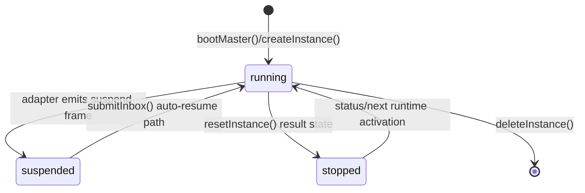

# Instance Lifecycle

> Instance lifecycle is owned by `createInstanceManager()`, which manages creation, runtime state, reset/deletion, and adapter session attachment.

## Overview

An instance record is a persisted in-memory object with API-facing fields (`id`, `prototype`, `status`, `projects`) plus runtime internals (`containerId`, `projectName`, `composePath`, `initVersion`).

The manager pre-seeds a reserved master (`inst_0`) and exposes CRUD-like methods used by HTTP handlers. Runtime transitions occur both from direct lifecycle operations and from adapter outbox frames (notably suspend).

## States

Core status union comes from `@sumeru/core`:

- `running`
- `stopped`
- `idle`
- `suspended`

In current host flow, `running`, `stopped`, and `suspended` are actively assigned. `idle` remains a valid type for forward-compatible state modeling.

## Lifecycle Flow

## Create / Delete / Reset

- Create:
  - checks `resources.maxInstances` against running non-master instances.
  - validates prototype existence.
  - allocates `inst_<ULID>` and project name.
  - calls transport `up` and stores returned runtime handle.
- Delete:
  - forbids `inst_0` (`cannot_delete_master`).
  - stops adapter session, then transport `down` and `rm`.
  - removes instance record.
- Reset:
  - forbids master (`cannot_reset_master`).
  - stops adapter and tears runtime down.
  - clears OCAS history for that instance.
  - recreates runtime and sets status to `stopped` with `initVersion = null`.

## Master Special Handling

- `inst_0` is created before any API request handling.
- `bootMaster()` performs transport `up` for master project.
- master record has `prototype: null` and is omitted from regular prototype creation flow.
- delete/reset guards explicitly block destructive operations on master.

## Resource Guard

`createInstance()` computes running worker count and enforces `hostConfig.config.resources.maxInstances`. Exceeding the limit raises `resource_exhausted`, surfaced as `503` by HTTP handlers.

## Code Pointers

| Package | File | What it does |
|---------|------|--------------|
| `@sumeru/host` | `packages/host/src/instance-manager.ts` | Full lifecycle implementation and state transitions. |
| `@sumeru/host` | `packages/host/src/types.ts` | Defines `ManagedInstance` shape and status-bearing response types. |
| `@sumeru/host` | `packages/host/src/id.ts` | Generates `inst_*` IDs and project names from instance IDs. |
| `@sumeru/host` | `packages/host/src/handlers/instances.ts` | Maps lifecycle errors to HTTP status codes and envelopes. |

## See Also

- [Suspend & Resume](./suspend-resume.md) — suspend-triggered runtime transitions.
- [Prototype Versioning & Lazy Re-init](./prototype-versioning.md) — initVersion semantics.
- [Master Agent](./master-agent.md) — `inst_0` runtime model.
