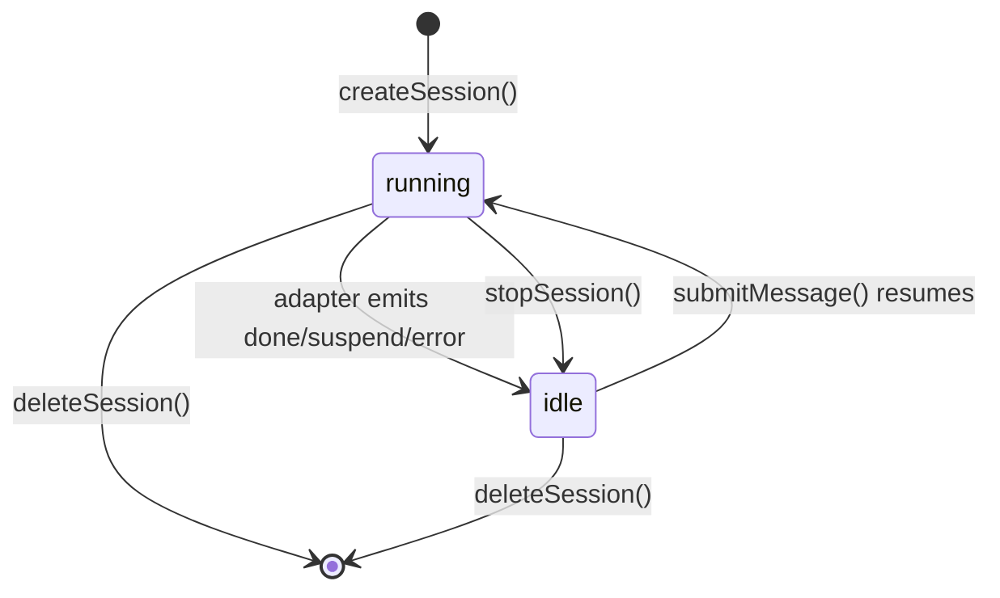

# Session Lifecycle

> Session lifecycle is owned by `createSessionManager()`, which manages creation, runtime state, stop/deletion, adapter session attachment, and model override.

## Overview

A session record (`ManagedSession`) is an in-memory object with API-facing fields (`id`, `prototype`, `model`, `status`, `exit`) plus runtime internals (`containerId`, `projectName`, `composePath`, `initVersion`, `sessionEnv`).

The manager exposes CRUD-like methods used by HTTP handlers. Runtime transitions occur from direct lifecycle operations and from adapter outbox frames (done/suspend/error signals).

## States

Core status union from `@sumeru/core`:

- `running` — adapter is actively processing
- `idle` — adapter completed, container still alive

## Lifecycle Flow

## Create

1. Validates prototype existence and compose path.
2. Resolves project path within `workspaceRoot` (path traversal guard).
3. Resolves model: session override > prototype.model > host.yaml `defaults.model` (via SQLite lookup by model ID).
4. Waits for a running slot (`maxRunning` concurrency gate).
5. Calls transport `up` (Docker Compose) and stores container handle.
6. Initializes adapter session (init frame → ready).
7. Delivers initial task as first message.

## Stop / Delete

- **Stop**: sets status to `idle`, emits stopped exit signal. Container stays alive.
- **Delete**: stops adapter, calls transport `down` + `rm`, removes record and OCAS history.

## Session Model Override

Sessions support model override at two points:

1. **Creation time**: `POST /sessions` body includes optional `model` field.
2. **Message time**: `POST /sessions/:id/messages` body includes optional `model` field.

When model changes mid-session, the adapter session is invalidated and re-initialized with new model config. This enables hot-switching models between messages without creating a new session.

Model references use a model ID string (e.g. `deepseek-v3`) or inline `{ provider, name }` objects.

## Concurrency Control

`maxRunning` from `host.yaml` gates how many sessions can be in `running` state simultaneously. When the limit is reached, new `createSession()` or `submitMessage()` calls wait for a slot to open (queue-style).

## Exit Signals

When the adapter finishes, an `ExitSignal` is produced with:
- `type`: complete | failed | needsInput | timeout | stopped | exhausted
- `elapsedMs`, `turnCount`, `tokenUsage`
- Optional `message` for complete/failed/needsInput types

## Code Pointers

| Package | File | What it does |
|---------|------|--------------|
| `@sumeru/host` | `packages/host/src/session-manager.ts` | Full lifecycle: create, stop, delete, message, events, model override. |
| `@sumeru/host` | `packages/host/src/types.ts` | Defines `ManagedSession`, `CreateSessionRequest`, `SessionModelOverride`. |
| `@sumeru/host` | `packages/host/src/id.ts` | Generates `ses_*` ULID session IDs and `msg_*` message IDs. |
| `@sumeru/host` | `packages/host/src/config.ts` | `resolveSessionModel()` — model resolution with override support. |

## See Also

- [Suspend & Resume](./suspend-resume.md) — suspend-triggered state transitions.
- [Prototype Versioning](./prototype-versioning.md) — `initVersion` semantics.
- [Host HTTP Service](./host-service.md) — API endpoints driving lifecycle.
