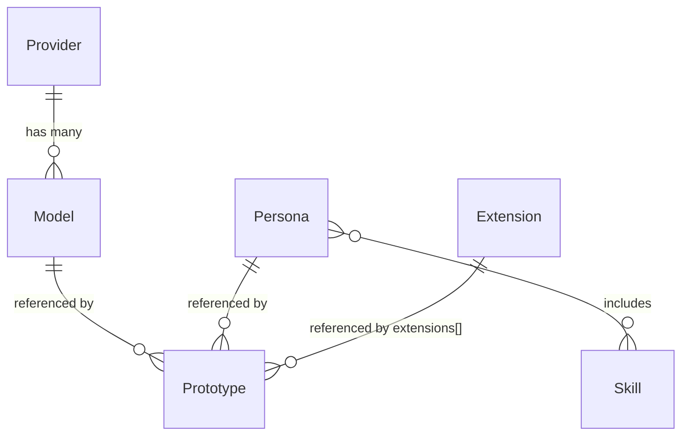

# V3 Data Model

> V3 replaces the monolithic `manifest.yaml` with a hybrid SQLite + YAML data model. Provider, Model, Persona, and Skill are SQLite entities; Prototype and Extension are YAML-based.

## Overview

The V3 data model separates concerns: configuration entities that require CRUD operations (providers, models, personas, skills) live in SQLite at `data/sumeru.db`. Prototype definitions — which bind persona + model + adapter into a deployable unit — remain as individual YAML files under `data/prototypes/`. Extensions (Dockerfile instruction layers) live at `data/extensions/*.yaml`. This hybrid allows the CLI and host to share database access via the `@sumeru/host/sqlite` subpath export.

## Entity Relationships



## SQLite Schema (v3)

**providers** table:
- `name` TEXT PK, `api_type` TEXT, `base_url` TEXT, `api_key` TEXT, timestamps

**models** table:
- `id` TEXT PK (`provider:name`), `provider` TEXT FK→providers, `model` TEXT (LLM name), `context_window` INT, `tool_use` BOOL, `streaming` BOOL, `metadata` JSON, timestamps

**personas** table:
- `name` TEXT PK, `instructions` TEXT, `skills` JSON array, timestamps

**skills** table:
- `name` TEXT PK, `content` TEXT, timestamps

Migrations run automatically (schema version tracked in `PRAGMA user_version`).

## Prototype YAML

Individual files at `data/prototypes/<name>.yaml`:

```yaml
name: sarsapa
persona: default
model: siliconflow:deepseek-v3
adapter: sarsapa
extensions:
  - rust
```

Each prototype references:
- A persona name (resolved from SQLite)
- A model id in `provider:name` format (resolved from SQLite)
- An adapter name (Docker image tag derived from adapter; declared in `prototypes/<name>/compose.yaml`)
- Optional `extensions[]` — ordered list of Extension names to layer on the base adapter image
- Optional `defaults: { maxTurns, timeout, resources: { cpu, memory } }`

## Extension YAML

Individual files at `data/extensions/<name>.yaml`:

```yaml
name: rust
description: "Install Rust toolchain"
dockerfile: |
  RUN curl --proto '=https' --tlsv1.2 -sSf https://sh.rustup.rs | sh -s -- -y
  ENV PATH="/root/.cargo/bin:${PATH}"
```

Managed via `PUT /extensions/:name` (upsert). Prototype creation validates all referenced extensions exist.

## host.yaml

```yaml
name: sumeru
maxRunning: 3
workspaceRoot: ~/.sumeru/workspace
envFile: ~/.sumeru/.env
defaults:
  model: siliconflow:deepseek-v3   # provider:name fallback when prototype.model is null
  timeout: 120
  maxTurns: 20
  resources:
    cpu: 2
    memory: "4g"
```

The legacy `models` section is deprecated — a warning is emitted if present, directing users to use SQLite entities instead.

## Model Resolution at Session Time

`resolveSessionModel()` in config.ts handles model override:

1. If session provides an inline model object → use directly.
2. If session provides a `"provider:name"` string → look up in SQLite.
3. Otherwise → use prototype's model id, then host.yaml `defaults.model` → look up in SQLite.

Resolution joins Provider (for endpoint + apiType) with Model (for LLM model name) to produce a `ModelConfig` used by the adapter init frame.

## Prototype Compose Convention

Each prototype can have a `compose.yaml` at `prototypes/<name>/compose.yaml` that defines the Docker Compose service. The compose file must bind-mount `${SUMERU_PROJECT_PATH}` for adapter cwd access. Image tag convention: `sumeru/sarsapa:dev` for sarsapa, `sumeru/adapter-<name>:dev` for other adapters.

## Code Pointers

| Package | File | What it does |
|---------|------|--------------|
| `@sumeru/core` | `packages/core/src/types.ts` | Canonical type definitions for all entities. |
| `@sumeru/host` | `packages/host/src/sqlite-store.ts` | SQLite CRUD implementation (better-sqlite3). |
| `@sumeru/host` | `packages/host/src/config.ts` | Loads host.yaml, prototypes, extensions, opens SQLite store. |
| `@sumeru/host` | `packages/host/src/data-store.ts` | Prototype/extension YAML loading and hash computation. |

## See Also

- [Architecture Overview](./architecture-overview.md) — how the data model fits the runtime layers.
- [Prototype Versioning](./prototype-versioning.md) — hash/version behavior over prototype changes.
- [CLI Tool](./cli.md) — `setup` command that seeds the data model.
