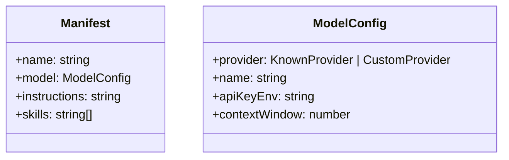

# manifest.yaml Schema

> Prototype manifests are validated into `@sumeru/core` types and become adapter init payload sources.

## Overview

`validateManifest()` in host config loader enforces required structure and value types. Parsed output is strongly typed as `Manifest` and contains four core fields: `name`, `model`, `instructions`, and `skills`.

Model schema supports both known provider literals and custom provider mappings, allowing either built-in provider routing or explicit API endpoint binding.

## Manifest Shape

## Validation Rules

- top-level document must be YAML mapping.
- `name`: required non-empty string.
- `instructions`: required string.
- `skills`: optional array; if present, must contain only strings.
- `model`: required mapping validated by `validateModelConfig()`.

Model rules:

- `provider` can be:
  - known string: `anthropic`, `openai`, `openrouter`
  - custom object: `{ baseUrl, apiType }` with `apiType` in `openai|anthropic`
- `name`: required non-empty string.
- `apiKeyEnv`: required non-empty string.
- `contextWindow`: required finite number.

## Host Config Context

`host.yaml` schema is separate but related:

- `name`, `master`, `resources`, optional `dataDir`
- master config supplies adapter command and init payload for `inst_0`
- resources include `maxInstances`, which gates runtime creation

## Prototype Directory Conventions

The loader scans each directory under `prototypes/` and expects:

- `manifest.yaml`
- `compose.yaml`
- optional `skills/<skill-name>/...`

Prototype map key is directory name. Manifest `name` is currently used as adapter label field in prototype responses.

## Compose File Handling

`compose.yaml` is not schema-validated by host code. It is treated as an opaque path forwarded to Docker Compose transport calls.

## Code Pointers

| Package | File | What it does |
|---------|------|--------------|
| `@sumeru/core` | `packages/core/src/types.ts` | Canonical `Manifest`, `ModelConfig`, provider, and host config type definitions. |
| `@sumeru/host` | `packages/host/src/config.ts` | YAML loading and schema validation for manifest + host config. |
| `@sumeru/host` | `packages/host/src/types.ts` | `PrototypeInfo` structure that stores manifest + compose path + hash. |

## See Also

- [Prototype Versioning & Lazy Re-init](./prototype-versioning.md) — hash/version behavior over manifest and skills.
