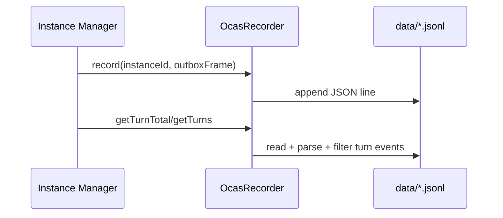

# OCAS Recording & History

> Host records per-instance outbox events to JSONL and exposes history/search/export APIs over those logs.

## Overview

`createOcasRecorder(dataDir)` stores events into `<instanceId>.jsonl` files. Every recorded line includes timestamp, event type, and event value. The recorder’s API focuses on turn-centric retrieval while still writing all outbox event types.

History/search/export handlers provide separate read paths:

- history: paginated turn list for one instance
- search: in-memory scan across JSONL files
- export: gzip download of raw JSONL file

## Recording Pipeline

## What Gets Recorded

- Manager records outgoing adapter frames (`turn`, `done`, `suspend`, `error`).
- Manager also records inbound user inbox content as synthetic `turn` (`role: user`).
- JSONL files are created lazily on first append.
- `resetInstance()` clears the instance JSONL file via recorder `clear()`.

## History Endpoint

`GET /instances/:id/history`:

- validates instance existence.
- supports `limit` (default 100, capped 1000) and `offset` (default 0).
- returns `@sumeru/history` with total turn count + page slice.

## Search Endpoint

`GET /search?q=<query>&instance=<optional-id>`:

- requires non-empty `q`.
- optional instance filter.
- builds `SearchIndex` by reading all `.jsonl` files in data dir.
- matches query against `turn.value.content` (case-insensitive substring).
- returns snippet highlight with fixed-radius context.

## Export Endpoint

`POST /instances/:id/export`:

- checks instance exists and history file exists/non-empty.
- streams gzip-compressed JSONL as attachment `<id>.jsonl.gz`.
- content type is `application/gzip`.

## Code Pointers

| Package | File | What it does |
|---------|------|--------------|
| `@sumeru/host` | `packages/host/src/ocas-recorder.ts` | JSONL append/read/clear implementation and turn filtering API. |
| `@sumeru/host` | `packages/host/src/handlers/history.ts` | Paginated history API with envelope formatting and query validation. |
| `@sumeru/host` | `packages/host/src/handlers/search.ts` | Search API wrapper and query parameter validation. |
| `@sumeru/host` | `packages/host/src/search.ts` | In-memory grep-like index over JSONL turn content. |
| `@sumeru/host` | `packages/host/src/handlers/export.ts` | Gzipped raw JSONL export handler. |

## See Also

- [Host HTTP Service](./host-service.md) — API-level route behavior for history/search/export.
