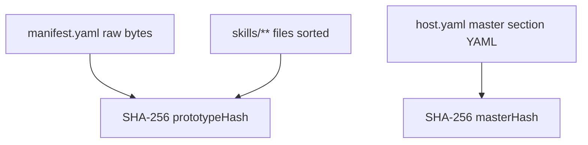

# Prototype Versioning & Lazy Re-init

> Host tracks prototype/master config hashes and lazily reinitializes adapters when version drift is detected.

## Overview

Initialization state is versioned per instance using `initVersion`. Version values are content hashes, not counters. On each inbox, host compares current hash vs stored `initVersion` and re-initializes adapter session when stale.

This avoids eagerly restarting all running instances when files change, while still ensuring next interaction uses current instructions/skills/model config.

## Hash Inputs

- `computePrototypeHash(manifestPath, skillsDir)` hashes:
  - literal manifest bytes prefixed with `manifest\0`
  - all files under each skill directory, path-tagged and sorted
- `computeMasterHash(configPath)` hashes serialized `master` mapping from host config.

## Instance Tracking

`ManagedInstance.initVersion` stores last applied hash.

- New/reset instances start with `initVersion: null`.
- After successful `init -> ready`, host sets `initVersion` to current hash.
- On stale comparison, host invalidates session and rebuilds init config.

## Lazy Re-init Behavior

On `submitInbox()` path:

- resolve current target hash (`prototypeHash` or `masterHash`).
- if runtime is initialized and hash changed (and not suspended), close stdin and clear session.
- rebuild init payload from current manifest/skills or master config.
- restart adapter exec session, send fresh init frame, await ready.
- continue with message send.

## Master-specific Drift Handling

Master uses the same lazy pattern but with:

- hash source: `hostConfig.masterHash`
- init builder: `buildMasterInitConfig()`
- command resolver: `resolveMasterAdapterCommand()`

So host config changes are applied on next master inbox rather than immediate restart.

## Skill Hash Determinism

Prototype hash stability depends on deterministic traversal:

- skill directories are lexicographically sorted.
- files within each skill subtree are recursively collected then sorted.
- hash input includes relative file path (`skill:<relpath>\\0`) and raw file bytes.

This ensures identical content trees produce identical hashes regardless of filesystem entry order.

## Re-init Guard Conditions

Host only invalidates an existing initialized session when all are true:

- detected version drift (`initVersion !== currentHash`)
- active session exists and is initialized
- instance status is not currently `suspended`

If suspended, host keeps resume-related state and refreshes init when next active session starts.

## Code Pointers

| Package | File | What it does |
|---------|------|--------------|
| `@sumeru/host` | `packages/host/src/config.ts` | Computes prototype and master hashes; loads manifest/skills/master config. |
| `@sumeru/host` | `packages/host/src/instance-manager.ts` | Compares hash vs `initVersion` and performs lazy adapter re-init. |
| `@sumeru/host` | `packages/host/src/types.ts` | Defines `ManagedInstance.initVersion` persisted in manager state. |

## See Also

- [Instance Lifecycle](./instance-lifecycle.md) — where `initVersion` lives in runtime records.
- [manifest.yaml Schema](./manifest-schema.md) — fields that feed init payload and hashes.
