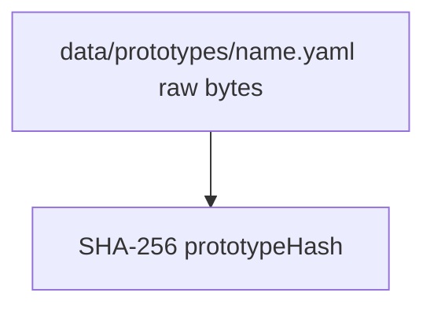

# Prototype Versioning & Lazy Re-init

> Host tracks prototype config hashes and lazily reinitializes adapter sessions when version drift is detected.

## Overview

Initialization state is versioned per session using `initVersion`. Version values are content hashes (SHA-256), not counters. On each message submission, the session manager compares the current prototype hash vs stored `initVersion` and re-initializes the adapter session when stale.

This avoids eagerly restarting all running sessions when prototype files change, while still ensuring the next interaction uses current persona/skills/model config.

## Hash Computation

`computePrototypeHash(yamlPath)` in `data-store.ts` hashes the raw YAML file content prefixed with `prototype\0`. The hash changes whenever the prototype YAML is modified (persona, model, image, or defaults change).

## Session Tracking

`ManagedSession.initVersion` stores the last applied hash.

- New sessions start with `initVersion: null`.
- After successful adapter `init → ready`, session manager sets `initVersion` to current hash.
- On stale comparison, manager invalidates session and rebuilds init config.

## Lazy Re-init Behavior

On `submitMessage()` and `ensureAdapterReady()` path:

1. Resolve current prototype hash from `hostConfig.prototypes`.
2. Compare with `record.initVersion`.
3. If hash changed and adapter session is initialized and running:
   - Close existing adapter stdin (invalidate session).
   - Rebuild init config with updated persona/skills/model from SQLite + prototype.
   - Restart adapter exec, send fresh init frame, await ready.
4. Continue with message delivery.

## Model Override Interaction

When a session uses model override (via create or message `model` field), the override takes precedence over prototype model. However, prototype hash drift still triggers re-init to pick up persona/skill changes — the overridden model is preserved through the re-init.

## Re-init Guard Conditions

Host only invalidates an existing initialized session when all are true:

- Detected version drift (`initVersion !== currentHash`)
- Active session exists and is initialized
- Session is currently in `running` state

## Code Pointers

| Package | File | What it does |
|---------|------|--------------|
| `@sumeru/host` | `packages/host/src/data-store.ts` | Computes prototype hash from YAML content. |
| `@sumeru/host` | `packages/host/src/session-manager.ts` | Compares hash vs `initVersion` and performs lazy re-init. |
| `@sumeru/host` | `packages/host/src/types.ts` | Defines `ManagedSession.initVersion` and `PrototypeInfo.prototypeHash`. |

## See Also

- [Session Lifecycle](./instance-lifecycle.md) — where `initVersion` lives in runtime records.
- [V3 Data Model](./manifest-schema.md) — prototype YAML structure and entity relationships.
