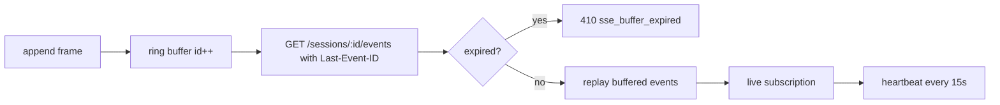

# SSE Reliability

> Event streaming uses a bounded replay buffer, Last-Event-ID recovery, and heartbeat events to survive short client disconnects.

## Overview

Each session owns an `SseBuffer` ring with default capacity 1024 events. Every appended event gets a monotonically increasing integer id (`nextId`), enabling at-least-once replay after reconnect.

The events handler validates `Last-Event-ID`, replays buffered events after that id, then subscribes to live updates. Terminal events (`exit`) close the SSE response.

## Reliability Model

## Replay and Expiration

- `eventsAfter(lastId)` returns all buffered events with larger ids.
- `isExpired(lastEventId)` checks whether requested id is older than oldest retained event.
- Expired reconnect attempts get `410 Gone` with `sse_buffer_expired` envelope.
- Non-expired reconnects begin from requested watermark and continue live.

## Flush and Heartbeat

- SSE headers disable proxy buffering (`X-Accel-Buffering: no`) and set keep-alive headers.
- `res.socket?.setNoDelay(true)` reduces flush latency.
- Handler appends `heartbeat` events every 15 seconds.
- CLI `logs` command explicitly ignores heartbeat events.

## Terminal Semantics

- Replay path: if replay includes `exit` event, stream is ended immediately.
- Live path: stream is ended when terminal event arrives.
- On connection close, handler unsubscribes and clears heartbeat timer.

## Client Reconnect Guidance

- Persist the last received SSE `id` client-side after each event.
- Reconnect with `Last-Event-ID` header to recover buffered events.
- Treat `410 sse_buffer_expired` as a hard gap requiring history/export fallback.
- Ignore `heartbeat` events for business logic; they are transport liveness only.

## Code Pointers

| Package | File | What it does |
|---------|------|--------------|
| `@sumeru/host` | `packages/host/src/sse-buffer.ts` | Ring buffer with id progression and expiration checks. |
| `@sumeru/host` | `packages/host/src/handlers/events.ts` | Last-Event-ID replay, heartbeat, subscription, and terminal close. |
| `@sumeru/host` | `packages/host/src/http-utils.ts` | SSE headers and event writing utilities. |

## See Also

- [Host HTTP Service](./host-service.md) — route contract for events endpoint.
