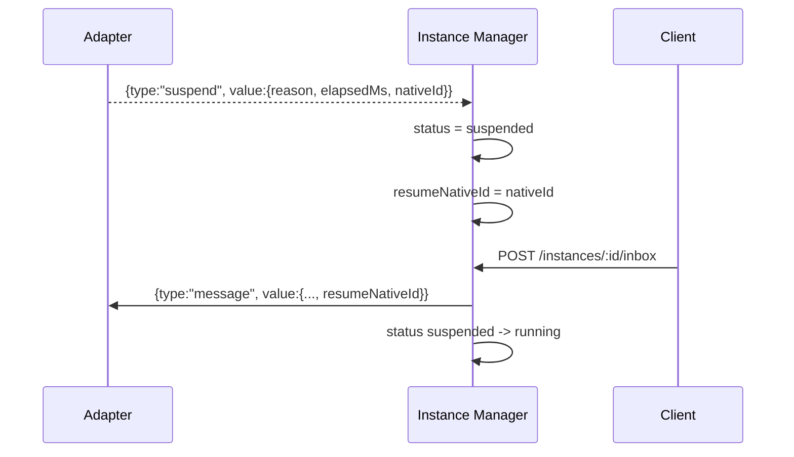

# Suspend & Resume

> Suspend/resume bridges adapter-native session continuity with host-level instance state transitions.

## Overview

Suspend is emitted as an outbox frame and persisted through host runtime state. When a suspend frame arrives, the instance status flips to `suspended`, the adapter session is detached, and a `nativeId` resume token is cached.

On the next inbox for the same instance, host injects cached `resumeNativeId` into the message frame so adapter implementations can continue the same underlying agent session.

## Suspend Reasons

`SuspendValue.reason` supports three values in shared types:

- `timeout`
- `permissionRequest`
- `inputRequired`

`adapter-core` actively emits `timeout` from wrapper timeout behavior; the other two reasons are available for adapter-initiated suspend yields.

## Flow

## Host Runtime Handling

- `readAdapterOutput()` detects suspend frames and updates managed instance status.
- `extractSuspendNativeId()` parses `value.nativeId` when non-empty.
- runtime session is nulled and marked uninitialized after suspend.
- `submitInbox()` injects cached `resumeNativeId` and flips status back to `running`.

## Adapter Runtime Handling

- `runAdapterEntry()` stores incoming `message.resumeNativeId`.
- `resolveNativeId()` prefers `impl.getNativeId()` over stored value.
- timeout path emits suspend + native id and exits loop.
- impl-generated suspend yields are passed through with resolved native id.

## Operational Notes

- Resume is lazy: no explicit resume endpoint; next inbox triggers continuation.
- Suspend does not delete history; frames continue to be recorded in OCAS log.
- If adapter native session is invalid, adapter exits with error and host surfaces outbox error frame.

## Code Pointers

| Package | File | What it does |
|---------|------|--------------|
| `@sumeru/adapter-core` | `packages/adapter-core/src/entrypoint.ts` | Emits suspend frames for timeout and impl suspend yields. |
| `@sumeru/host` | `packages/host/src/instance-manager.ts` | Stores `resumeNativeId`, updates status, and injects resume token on inbox. |
| `@sumeru/core` | `packages/core/src/types.ts` | Defines suspend reason union and payload structure. |

## See Also

- [Instance Lifecycle](./instance-lifecycle.md) — state transitions involving `suspended`.
- [Adapter Unified I/O Contract](./adapter-contract.md) — frame-level suspend semantics.
