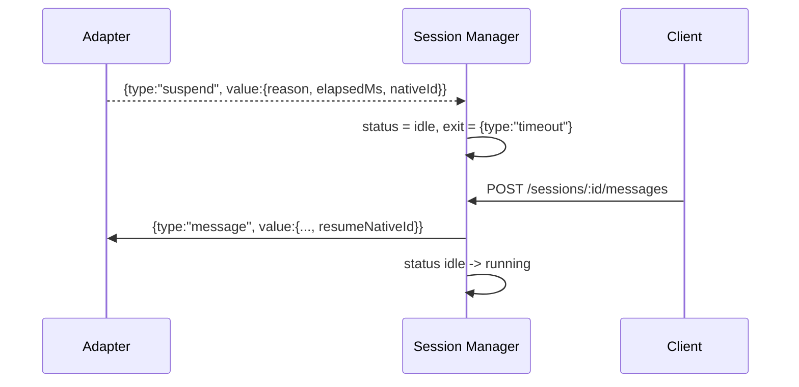

# Suspend & Resume

> Suspend/resume bridges adapter-native session continuity with host-level session state transitions.

## Overview

Suspend is emitted as an outbox frame when the adapter times out or yields a suspend checkpoint. When a suspend frame arrives, the session status flips to `idle`, an exit signal is recorded, and a `nativeId` resume token is available for future continuation.

On the next message for the same session, host injects the resume context so adapter implementations can continue the same underlying agent session.

## Suspend Reasons

Adapter-core supports suspend via:

- **timeout**: wrapper fires when `sendTimeoutMs` (default 7,200,000 ms) is exceeded.
- **impl-initiated**: adapter yields `{ type: "suspend" }` from its handle generator.

## Flow

## Host Runtime Handling

- Session manager detects suspend/done frames and sets session to `idle` with exit signal.
- Adapter session remains attached — container stays alive.
- `submitMessage()` resumes the session by flipping status to `running` and delivering new message.
- `resumeNativeId` is injected from adapter's `getNativeId()` so native session can be continued.

## Adapter Runtime Handling

- `runAdapterEntry()` stores incoming `message.resumeNativeId`.
- `resolveNativeId()` prefers `impl.getNativeId()` over stored value.
- Timeout path emits suspend + native id and exits loop.
- Impl-generated suspend yields are passed through with resolved native id.

## Code Pointers

| Package | File | What it does |
|---------|------|--------------|
| `@sumeru/adapter-core` | `packages/adapter-core/src/entrypoint.ts` | Emits suspend frames for timeout and impl suspend yields. |
| `@sumeru/host` | `packages/host/src/session-manager.ts` | Handles suspend → idle transition, resume on next message. |
| `@sumeru/adapter-core` | `packages/adapter-core/src/types.ts` | Defines SuspendValue and adapter frame unions. |

## See Also

- [Session Lifecycle](./instance-lifecycle.md) — state transitions involving idle after suspend.
- [Adapter Unified I/O Contract](./adapter-contract.md) — frame-level suspend semantics.
