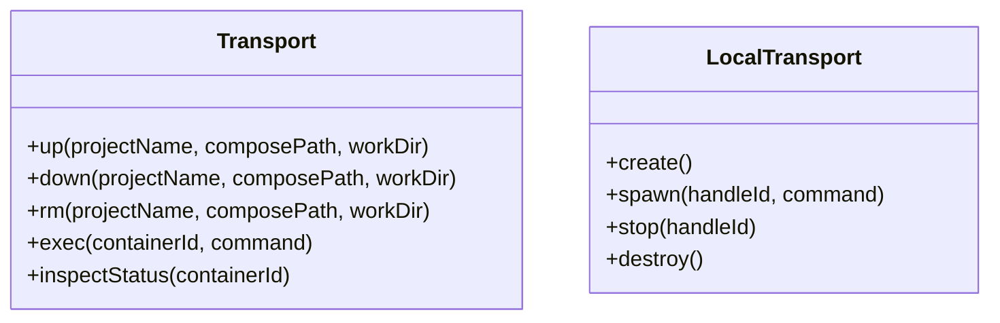

# Transport Layer

> The transport layer abstracts instance runtime control (`up/down/rm/exec/inspectStatus`) across Docker and local process backends.

## Overview

The host uses a runtime-agnostic `Transport` interface so lifecycle code does not depend on a single execution backend. Worker instances run through Docker Compose and `docker exec`, while the reserved master uses local child processes.

A secondary `LocalTransport` abstraction models in-memory process handles with explicit create/spawn/stop/destroy functions. `createRoutingTransport()` selects local transport for the master project and Docker transport for all other projects.

## Transport Interfaces

## DockerTransport

- `up`: executes `docker compose -f <compose> -p <project> up -d`, then resolves first container id from `docker compose ... ps -q`.
- `down`: executes compose `down` in project scope.
- `rm`: executes compose `rm -f`.
- `exec`: spawns `docker exec -i <container> <command...>` with stdin/stdout pipes and line iterator.
- `inspectStatus`: runs `docker inspect -f {{.State.Running}}` and maps to `running`/`stopped`.

## LocalTransport + Routing

- Local handle id constant is `master`.
- `createLocalTransportImpl.spawn()` runs `child_process.spawn` directly.
- Existing local process for handle is SIGTERMed before respawn.
- Routing condition for `up/down/rm`: `projectName === masterProjectName` => local.
- Routing condition for `exec/inspectStatus`: `containerId === LOCAL_MASTER_HANDLE` => local.

## Session Surface

Both Docker and local `exec()` return `TransportExecSession`:

- writable `stdin` for NDJSON frames.
- async iterable `lines` from stdout.
- `waitForExit()` with exit code and captured stderr.

This uniform surface is what the instance manager binds to adapter runtime loops.

## Code Pointers

| Package | File | What it does |
|---------|------|--------------|
| `@sumeru/host` | `packages/host/src/types.ts` | Defines `Transport` and `TransportExecSession` contracts. |
| `@sumeru/host` | `packages/host/src/transport.ts` | Docker-backed implementation using compose and exec commands. |
| `@sumeru/host` | `packages/host/src/local-transport.ts` | Local child-process transport and routing transport composition. |
| `@sumeru/host` | `packages/host/src/server.ts` | Wires docker + local into `createRoutingTransport()` during host start. |

## See Also

- [Host HTTP Service](./host-service.md) — APIs that trigger transport lifecycle actions.
- [Adapter Unified I/O Contract](./adapter-contract.md) — NDJSON protocol sent over transport sessions.
